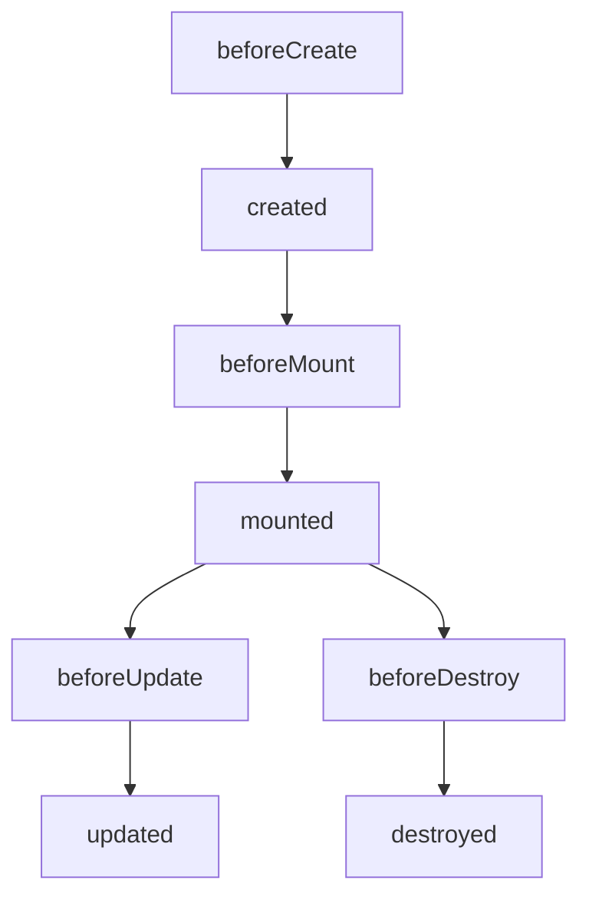
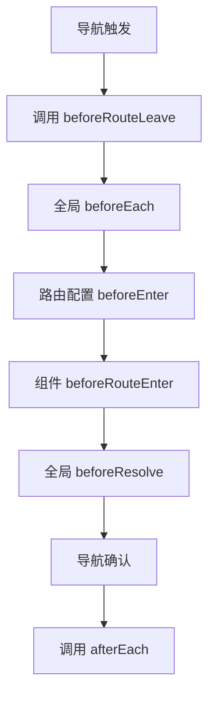
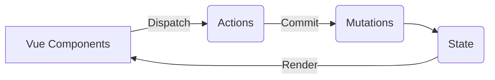

以下是将内容转换为 Markdown 格式后的结果：

```markdown
# Vue 核心知识体系梳理

## 一、Vue 基础概念

### 1. MVVM 模式理解
- **核心思想**：Model-View-ViewModel 架构
- **分层职责**：
  - Model：数据模型层
  - View：UI 视图层
  - ViewModel：数据绑定与 DOM 监听的中介

### 2. 组件化开发
- **Data 必须为函数**：避免组件复用时的数据污染
- **组件通信方式**：
  - 父子：Props / $emit
  - 兄弟：Event Bus / Vuex
  - 跨级：provide/inject / $attrs/$listeners

## 二、生命周期机制

### 1. 生命周期图示


### 2. 各阶段核心行为
| 生命周期       | 触发时机                          | 典型应用场景                     |
|----------------|----------------------------------|----------------------------------|
| beforeCreate   | 实例初始化后，数据观测前          | 初始化非响应式变量               |
| created        | 实例创建完成，数据已观测          | API请求、数据初始化               |
| beforeMount    | 挂载开始前，render函数首次调用    | 最后的数据修改机会                |
| mounted        | DOM挂载完成                      | DOM操作、第三方库初始化           |
| beforeUpdate   | 数据更新时，虚拟DOM打补丁前       | 更新前状态获取                    |
| updated        | 虚拟DOM重新渲染后                | DOM相关操作（谨慎修改数据）       |
| beforeDestroy  | 实例销毁前                      | 定时器清除、事件监听移除           |
| destroyed      | 实例销毁后                      | 清理内存引用                      |

## 三、响应式系统

### 1. Vue2 实现原理
- **核心机制**：`Object.defineProperty`
- **数据劫持**：
  ```javascript
  Object.defineProperty(obj, key, {
    get() { /* 依赖收集 */ },
    set(newVal) { /* 触发更新 */ }
  })
  ```
- **数组处理**：重写数组原型方法（push/pop等）

### 2. Vue3 升级方案
- **Proxy 优势**：
  - 直接监听对象而非属性
  - 支持数组索引修改、length变化
  - 13种拦截操作
- **深度响应**：
  ```javascript
  function reactive(obj) {
    if (typeof obj === 'object') {
      return new Proxy(obj, { /* 处理器 */ })
    }
    return obj
  }
  ```

## 四、虚拟DOM与Diff算法

### 1. Diff 算法核心逻辑
- **同级比较**：避免跨层级节点移动
- **双端比较策略**：
  - 旧头 vs 新头
  - 旧尾 vs 新尾
  - 旧头 vs 新尾
  - 旧尾 vs 新头

### 2. Key 的作用机制
- **虚拟节点标识**：高效复用相同类型元素
- **避免错误复用**：列表变动时正确识别元素位置

## 五、模板编译原理

### 1. 编译三阶段
- **Parse**：模板 -> AST（抽象语法树）
- **Optimize**：标记静态节点
- **Generate**：AST -> render 函数

### 2. 运行时编译 vs 预编译
- **开发环境**：包含编译器（约30%体积）
- **生产环境**：仅运行时版本

## 六、Vue3 核心升级

### 1. 架构升级
- **Monorepo 管理**：模块化拆分
- **TypeScript 重构**：更好的类型支持

### 2. Composition API
- **逻辑复用**：取代 Mixins 方案
- **代码组织**：
  ```javascript
  setup() {
    const count = ref(0)
    const double = computed(() => count.value * 2)
    return { count, double }
  }
  ```

### 3. 性能优化
- **Tree-shaking**：按需引入 API
- **静态提升**：hoistStatic 优化
- **PatchFlag**：动态节点标记

## 七、高级特性解析

### 1. 异步组件
- **动态加载**：
  ```javascript
  const AsyncComponent = defineAsyncComponent(() => import('./Component.vue'))
  ```

### 2. 函数式组件
- **无状态组件**：通过 render 函数直接返回 VNodes

### 3. 自定义指令
- **生命周期钩子**：
  ```javascript
  const directive = {
    mounted(el, binding) { /* ... */ },
    updated(el, binding) { /* ... */ }
  }
  ```

## 八、工程化实践

### 1. 性能优化策略
- **代码层面**：
  - v-if/v-show 合理使用
  - 对象结构扁平化
  - 长列表虚拟滚动
- **打包优化**：
  - 代码分割（SplitChunks）
  - Gzip/Brotli 压缩
  - 第三方库 CDN 引入

### 2. SSR 服务端渲染
- **实现原理**：
  - Node.js 服务端生成 HTML
  - Client-side Hydration（激活）
- **优化指标**：
  - TTFB（Time to First Byte）
  - FCP（First Contentful Paint）

## 九、常见问题解析

### 1. computed vs watch
| 特性         | computed | watch |
|-------------|----------|-------|
| 缓存机制     | 有       | 无    |
| 异步支持     | 不支持   | 支持  |
| 适用场景     | 派生数据 | 副作用操作 |

### 2. 路由模式对比
| 模式       | 实现方式               | 特点                     |
|------------|-----------------------|--------------------------|
| hash       | window.location.hash  | 兼容性好，无需服务器配置 |
| history    | history.pushState API | 需要服务端支持，URL更美观 |

### 3. 组件缓存策略
- **keep-alive 机制**：
  ```html
  <keep-alive :include="['Home']">
    <router-view></router-view>
  </keep-alive>
  ```
- **LRU 缓存淘汰算法**：最近最少使用原则

## 十、生态体系

### 1. 状态管理（Vuex/Pinia）
| 特性         | Vuex       | Pinia       |
|-------------|------------|-------------|
| API 类型     | Options API | Composition API |
| 模块化       | 命名空间    | 自动命名空间  |
| TypeScript   | 需要类型增强 | 原生支持     |

### 2. 路由系统（Vue Router）
- **导航守卫**：
  - 全局守卫（beforeEach）
  - 路由独享守卫（beforeEnter）
  - 组件内守卫（beforeRouteEnter）

## 十一、路由深度解析（Vue Router）

### 1. 路由模式实现原理对比
| 模式       | 核心 API          | URL 示例                     | 服务端要求       |
|------------|-------------------|-----------------------------|------------------|
| Hash       | window.location.hash | `http://site.com/#/home`    | 无需特殊配置     |
| History    | history.pushState()  | `http://site.com/home`      | 需配置 Fallback  |
| Abstract   | 内存路由（Node.js 环境） | 无 URL 显示               | 服务端无关       |

### 2. 导航守卫全流程


### 3. 路由懒加载优化方案
```javascript
// Webpack 魔法注释
const Home = () => import(/* webpackChunkName: "home" */ './Home.vue')

// Vite 动态导入
const About = defineAsyncComponent(() => import('./About.vue'))
```

## 十二、状态管理进阶（Vuex → Pinia）

### 1. Vuex 核心架构


### 2. Pinia 核心优势
- **无嵌套的 Store 结构**：扁平化模块管理
- **完整的 TS 支持**：自动类型推断
- **Composition API 风格**：
  ```typescript
  export const useCartStore = defineStore('cart', () => {
    const items = ref<CartItem[]>([])
    const total = computed(() => items.value.reduce((sum, item) => sum + item.price, 0))
    function addItem(item: CartItem) { /* ... */ }
    return { items, total, addItem }
  })
  ```

### 3. 状态管理选型策略
| 场景           | Vuex       | Pinia       |
|---------------|------------|-------------|
| 老项目维护     | 推荐       | 不推荐      |
| 新项目开发     | 逐步淘汰   | 强烈推荐    |
| 复杂状态逻辑   | 适合（Modules系统） | 更适合（组合式API） |

## 十三、Composition API 深度实践

### 1. Reactivity 工具集
| API          | 功能描述                     | 典型场景             |
|-------------|-----------------------------|---------------------|
| ref()       | 创建响应式值（支持基本类型）  | 计数器、表单输入     |
| reactive()  | 创建响应式对象               | 复杂对象结构         |
| toRefs()    | 解构响应式对象保持响应性      | Props 解构           |
| watch()     | 响应式数据监听               | 异步操作、复杂逻辑触发 |
| watchEffect() | 自动依赖收集的副作用函数     | 实时数据同步         |

### 2. 自定义 Hook 开发模式
```typescript
// useMouseTracker.ts
export function useMouseTracker() {
  const x = ref(0)
  const y = ref(0)

  const update = (e: MouseEvent) => {
    x.value = e.pageX
    y.value = e.pageY
  }

  onMounted(() => window.addEventListener('mousemove', update))
  onUnmounted(() => window.removeEventListener('mousemove', update))

  return { x, y }
}

// 组件中使用
const { x, y } = useMouseTracker()
```

## 十四、渲染机制进阶

### 1. 异步组件加载策略
| 加载策略       | 实现方式                     | 用户体验               |
|---------------|-----------------------------|-----------------------|
| 同步加载       | 常规 import 语句            | 首屏加载慢            |
| 动态导入       | defineAsyncComponent + 动态导入 | 按需加载              |
| 骨架屏加载     | 配合 <Suspense> 使用        | 过渡效果平滑          |

### 2. Teleport 组件应用
```html
<!-- 将模态框渲染到 body 末端 -->
<teleport to="body">
  <div class="modal" v-if="showModal">
    <!-- 模态框内容 -->
  </div>
</teleport>
```

### 3. 自定义渲染器开发
```javascript
// 创建 Canvas 渲染器
import { createRenderer } from 'vue'

const { createApp } = createRenderer({
  createElement(type) { /* 创建图形元素 */ },
  insert(el, parent) { /* 插入到画布 */ },
  // ...其他节点操作方法
})

createApp(App).mount('#canvas-container')
```

## 十五、性能优化全方案

### 1. 运行时优化技巧
| 优化类型       | 具体措施                     | 效果评估               |
|---------------|-----------------------------|-----------------------|
| 组件懒加载     | 路由级/组件级动态导入        | 减少首屏资源 30%-50%  |
| 虚拟滚动       | 使用 vue-virtual-scroller    | 万级列表渲染优化       |
| 冻结大对象     | Object.freeze() 禁止响应式追踪 | 内存占用降低 20%+     |

### 2. 编译时优化策略
```javascript
// vue.config.js
module.exports = {
  chainWebpack: config => {
    config.optimization.splitChunks({
      chunks: 'all',
      minSize: 20000,
      maxAsyncRequests: 5
    })
  }
}
```

### 3. 内存泄漏防治
- **常见泄漏场景**：
  - 全局事件监听未移除
  - 定时器未清理
  - 第三方库实例未销毁
- **调试工具**：
  - Chrome Memory 面板
  - Vue DevTools 组件树检查

## 十六、测试与质量保障

### 1. 单元测试策略
| 测试类型       | 推荐工具       | 测试重点                 |
|---------------|---------------|-------------------------|
| 组件测试       | Vue Test Utils | Props/Events 验证       |
| 逻辑测试       | Vitest        | 纯函数/Composable 验证   |
| E2E 测试       | Cypress       | 用户流程验证             |

### 2. 测试代码示例
```typescript
// Counter.spec.ts
import { mount } from '@vue/test-utils'
import Counter from './Counter.vue'

test('increments counter', async () => {
  const wrapper = mount(Counter)
  await wrapper.find('button').trigger('click')
  expect(wrapper.find('span').text()).toBe('1')
})
```

## 十七、TypeScript 深度集成

### 1. 类型声明最佳实践
```typescript
// 组件 Props 类型声明
interface Props {
  title: string
  size?: 'small' | 'medium' | 'large'
}

defineProps<Props>()

// 自定义事件类型
const emit = defineEmits<{
  (e: 'update:modelValue', value: string): void
  (e: 'submit'): void
}>()
```

### 2. TSX 支持配置
```typescript
// tsconfig.json
{
  "compilerOptions": {
    "jsx": "preserve",
    "jsxFactory": "h",
    "jsxFragmentFactory": "Fragment"
  }
}
```
```